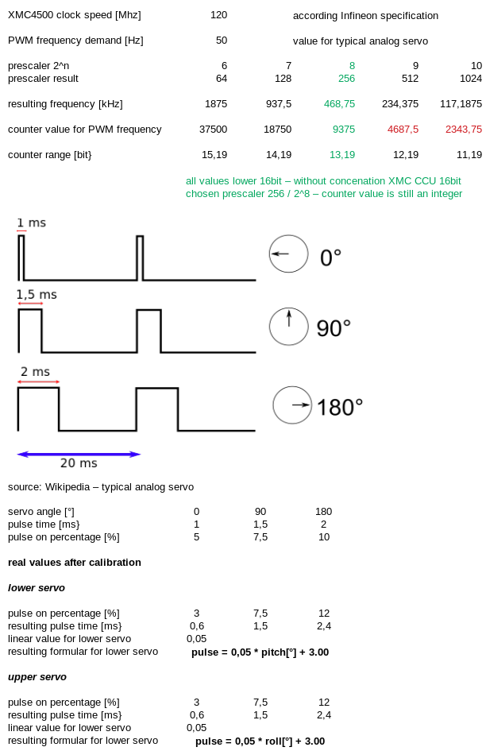
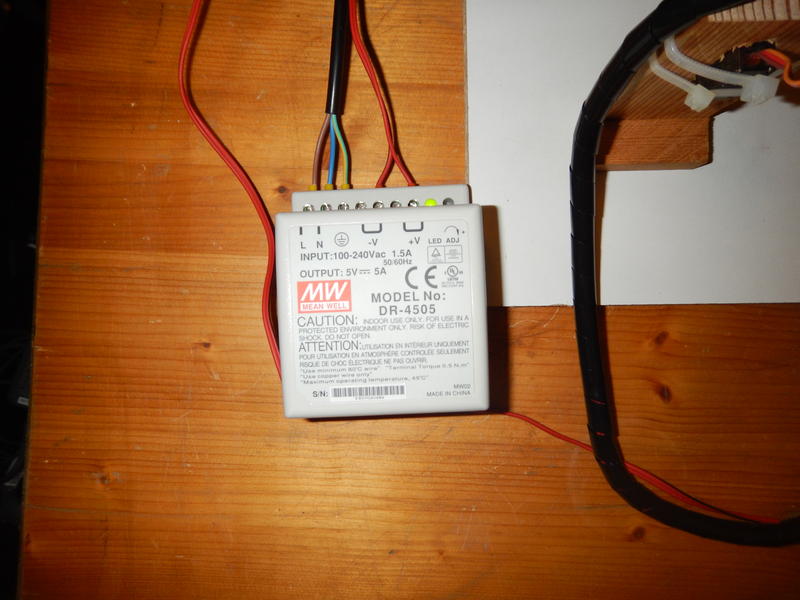

# XMC4500 acceleration sensor task - Werner Egermann, Helmut Resch - BEL3

# project description

## definition of task

https://cis.technikum-wien.at/documents/bel/3/ess/semesterplan/tasks/tasks.html

| screenshot task description |
|------------------------------------|
|  |

# realized task

The realized task is generic and a "proof of concept" for possibilities with the **Adafruit LIS3DH Triple-Axis Accelerometer** sensor.

As described in the definition the task is split into 2 major parts, the uC software for the Infineon XMC4500 and the GUI for the PC realized with GTK-3 + C and Python 3 + Pygame + Matplotlib.

The uC software includes a simple (bidirectional) UART communication protocol, libraries + drivers for:

- I2C communication
- sensor communication
- servocontrol
- buttons + LED control

Raw data from the accelerometer, 6D position and statistics can be requested by the PC application. The values are shown on the GUI. The rotation angles for all 3 axes and the pitch and roll angle are calculated within the PC application and shown on the GUI, also a simple freefall detection is included.

Within the GUI a statistic package (sent sensor readings, data packages, errors) can be requested, the data can be logged to harddisk, triggers for acceleration can be set and various settings like:

- activating UART connection
- requesting data from sensors
- activating servos
- changing between measurement averaging and "thresholding" for servo 

can be done.

BUTTON1 is used to switch on/off the servos and BUTTON2 is used to choose averaging / thersholding of sensor values for servo setting.

LED1 represents the PWM "percentage" of one servo, LED2 is on when GUI and XMC are connected, and toggles according when data is requested by the GUI.

2 python scripts can be started from the GUI, one to show possibilities for sprite rotation with the pygame library and one to show a graph for the accelerations.

# XMC software

## folders and files

The code is located in the folders 

* /src/ - all C source files
* /inc/ - all C header files

Details find in section "Files" in the doxygen documentation and further details are commented inside the source code.

## description

The graph shows the app > library > driver structure of the uC source code.

| dependency graph |
|------------------|
|  |

The graph shows the function calls of the uC source code.

| functions graph |
|-----------------|
|  |

## settings for the hardware PWM and angle correction of sensor

| calculations for PWM signal servos and necessary settings for counter and prescaler |
|------------------------------------|
|  |

| calculation for angle correction sensor |
|-----------------------------------------|
| sensor „Resch“ shows pitch angle up to maximum 85° - other direction seems ok with minimum -89° |
| correction value linear from 0 to +85° >> 0 up to +4.5 >> pitch = pitch + pitch * (4.5/85) |
| after calibration of servo and correction of sensor the pulse length and the frequency are stable |

## external code

- lis3dh_driver.c and lis3dh_driver.h provided by ST Microelectronics
- xmc4500_i2c_lib.c and xmc4500_i2c_lib.h provided by FHTW
- xmc4500_uart_lib.c and xmc4500_uart_lib.h provided by FHTW
- debug_lib.c and debug_lib.h provided by FHTW
- Makefile provided by FHTW

Thanks for this support!

## testing

### Source code test with cppcheck, only minor comments, external code excluded

	cppcheck --enable=all --std=posix --std=c99 --force --template=gcc ./inc/3Daccel_app.h ./inc/3Daccel_out_driver.h ./inc/3Daccel_out_library.h ./inc/lis3dh_library.h ./inc/servo_driver.h ./inc/servo_library.h ./src/3Daccel_app.c ./src/3Daccel_out_driver.c ./src/3Daccel_out_library.c ./src/lis3dh_library.c ./src/servo_driver.c ./src/servo_library.c

	Checking inc/3Daccel_app.h ...
	1/12 files checked 0% done
	Checking inc/3Daccel_out_driver.h ...
	2/12 files checked 2% done
	Checking inc/3Daccel_out_library.h ...
	3/12 files checked 9% done
	Checking inc/lis3dh_library.h ...
	4/12 files checked 11% done
	Checking inc/servo_driver.h ...
	5/12 files checked 13% done
	Checking inc/servo_library.h ...
	6/12 files checked 14% done
	Checking src/3Daccel_app.c ...
	Checking src/3Daccel_app.c: DEBUG...
	7/12 files checked 28% done
	Checking src/3Daccel_out_driver.c ...
	8/12 files checked 37% done
	Checking src/3Daccel_out_library.c ...
	src/3Daccel_out_library.c:63: style: The scope of the variable 'ticks' can be reduced.
	src/3Daccel_out_library.c:65: style: The scope of the variable 'i' can be reduced.
	src/3Daccel_out_library.c:66: style: The scope of the variable 'smoothSignal1' can be reduced.
	src/3Daccel_out_library.c:66: style: The scope of the variable 'smoothSignal2' can be reduced.
	Checking src/3Daccel_out_library.c: DEBUG...
	9/12 files checked 67% done
	Checking src/lis3dh_library.c ...
	10/12 files checked 84% done
	Checking src/servo_driver.c ...
	11/12 files checked 97% done
	Checking src/servo_library.c ...
	12/12 files checked 100% done
	src/3Daccel_out_library.c:61: style: The function 'SysTick_Handler' is never used.
	src/3Daccel_out_library.c:276: style: The function 'getDouble' is never used.
	:: information: Cppcheck cannot find all the include files (use --check-config for details)

### Source code test with splint, only minor comments, external code excluded

splint +posixlib -unrecog -standard +trytorecover -preproc -predboolint +matchanyintegral -exportlocal ./inc/3Daccel_app.h ./inc/3Daccel_out_driver.h ./inc/3Daccel_out_library.h ./inc/lis3dh_library.h ./inc/servo_driver.h ./inc/servo_library.h ./src/3Daccel_app.c ./src/3Daccel_out_driver.c ./src/3Daccel_out_library.c ./src/lis3dh_library.c ./src/servo_driver.c ./src/servo_library.c 

	Splint 3.1.2 --- 04 Aug 2017
	src/lis3dh_library.c: (in function initMEMSsensor)
	src/lis3dh_library.c:60:31: Function LIS3DH_SetAxis expects arg 1 to be
		LIS3DH_Axis_t gets enum { LIS3DH_X_ENABLE, LIS3DH_X_DISABLE,
		LIS3DH_Y_ENABLE, ..., LIS3DH_Z_DISABLE }:
		LIS3DH_X_ENABLE | LIS3DH_Y_ENABLE | LIS3DH_Z_ENABLE
	  Types are incompatible. (Use -type to inhibit warning)
	src/lis3dh_library.c: (in function configMEMSsensor)
	src/lis3dh_library.c:86:32: Function LIS3DH_SetInt1Threshold expects arg 1 to
		                           be u8_t gets int: 20
	src/lis3dh_library.c: (in function get6Dposition)
	src/lis3dh_library.c:165:37: Function LIS3DH_Get6DPosition expects arg 1 to be
		                            u8_t * gets uint8_t *: &position
	src/lis3dh_library.c: (in function getAxesRawData)
	src/lis3dh_library.c:233:37: Passed storage data contains 3 undefined fields:
		                            AXIS_X, AXIS_Y, AXIS_Z
	  Storage derivable from a parameter, return value or global is not defined.
	  Use /*@out@*/ to denote passed or returned storage which need not be defined.
	  (Use -compdef to inhibit warning)

	Finished checking --- 4 code warnings

2 functions in 3D_accel_out_driver.c had to be excluded for splint to avoid parse errors

	void outputInitXMC(void)
	{
		XMC_GPIO_CONFIG_t config_out;
		config_out.mode = XMC_GPIO_MODE_OUTPUT_PUSH_PULL;
		config_out.output_level = XMC_GPIO_OUTPUT_LEVEL_LOW;
		config_out.output_strength = XMC_GPIO_OUTPUT_STRENGTH_WEAK;
		XMC_GPIO_Init(LED1, &config_out);
	}

	void inputInitXMC()
	{
		XMC_GPIO_CONFIG_t config_in;
		config_in.mode = XMC_GPIO_MODE_INPUT_INVERTED_PULL_UP;
		XMC_GPIO_Init(BUTTON1, &config_in);
		XMC_GPIO_Init(BUTTON2, &config_in);
	}

# XMC hardware

## description

* /sensordocu/ - available documentation from ST Microelectronics

 

- sensor is connected via I2C and 3V3 to XMC, see lis3dh driver.c and lis3dh driver.h regarding used pins and hardware adress.

| sensor |
|--------|
|  |

- XMC connector includes 4k7 pullup resistors for I2C, signal and power connections, terminal blocks for external 5V power source (for servos) and terminal blocks to connected signals and power.

| XMC connector |
|---------------|
|  |

- external power source

The servos are supplied by an external 5V power source.

| power |
|-------|
|  |

- servos

Simple analog servos from Conrad used for the hardware.

| servos |
|--------|
|  |

- big picture

Simple wooden construction for the servos.

| big picture |
|-------------|
|  |

## testing

Oscilloscope screenshots of PWM signal.

| -90° / 0° | 0° | +90° / 180° |
|-----------|----|-------------|
|  |  |  |

# PC GUI software

## folders and files

The code is located in the folders 

* /gtk_GUI/ - all GTK GUI C source and header files
* /python/ - all PYTHON scripts as mentiond in the description and all necessary pictures
* /pictures/ - all pictures for README.md file

Details find in section "Files" in the doxygen documentation and further details are commented inside the source code.

## description

Graph of all GUI function calls.

| functions graph |
|-----------------|
|  |

## GUI overview

| GUI overview after start |
|--------------------------|
|  |

| GUI description |
|-----------------|
|  |

(0) Highlights values which have to be set before connection...

(1) Connect...

(2) Start transmission...

GTK buttons are set active or inactive as needed, feel free to experiment!

## external code

- rs232.c and rs232.h provided by FHTW
- Makefile provided by FHTW

Again thanks!

### testing

For the GTK GUI only cppcheck done.

	cppcheck --enable=all --std=posix --std=c99 --force --template=gcc 3DacceltaskGUI.c 3DacceltaskGUI.h menucallbacks.c menucallbacks.h

	Checking 3DacceltaskGUI.c ...
	Checking 3DacceltaskGUI.c: __FreeBSD__;__linux__...
	1/4 files checked 25% done
	Checking 3DacceltaskGUI.h ...
	Checking 3DacceltaskGUI.h: __FreeBSD__;__linux__...
	2/4 files checked 29% done
	Checking menucallbacks.c ...
	menucallbacks.c:488: style: The scope of the variable 'mode' can be reduced.
	menucallbacks.c:491: style: The scope of the variable 'requestConnection' can be reduced.
	menucallbacks.c:560: style: The scope of the variable 'requestServoOn' can be reduced.
	menucallbacks.c:597: style: The scope of the variable 'requestAveragePWM' can be reduced.
	Checking menucallbacks.c: __FreeBSD__;__linux__...
	3/4 files checked 95% done
	Checking menucallbacks.h ...
	Checking menucallbacks.h: __FreeBSD__;__linux__...
	4/4 files checked 100% done
	:: information: Cppcheck cannot find all the include files (use --check-config for details)

# Conclusion

Interesting and demanding task - especially the GUI.

Statistic of source code - total 3177 code lines without external code as mentioned above.

	wc ./inc/3Daccel_app.h ./inc/3Daccel_out_driver.h ./inc/3Daccel_out_library.h ./inc/lis3dh_library.h ./inc/servo_driver.h ./inc/servo_library.h ./src/3Daccel_app.c ./src/3Daccel_out_driver.c ./src/3Daccel_out_library.c ./src/lis3dh_library.c ./src/servo_driver.c ./src/servo_library.c ./gtk_GUI/3DacceltaskGUI.c ./gtk_GUI/3DacceltaskGUI.h ./gtk_GUI/menucallbacks.c ./gtk_GUI/menucallbacks.h -l
	   17 ./inc/3Daccel_app.h
	   35 ./inc/3Daccel_out_driver.h
	   72 ./inc/3Daccel_out_library.h
	   43 ./inc/lis3dh_library.h
	   28 ./inc/servo_driver.h
	   22 ./inc/servo_library.h
	  197 ./src/3Daccel_app.c
	  116 ./src/3Daccel_out_driver.c
	  447 ./src/3Daccel_out_library.c
	  219 ./src/lis3dh_library.c
	  100 ./src/servo_driver.c
	   62 ./src/servo_library.c
	  369 ./gtk_GUI/3DacceltaskGUI.c
	   83 ./gtk_GUI/3DacceltaskGUI.h
	 1286 ./gtk_GUI/menucallbacks.c
	   88 ./gtk_GUI/menucallbacks.h
	 3184 insgesamt

# Improvements

- GUI GTK code enhancement with respect to memory leaks
- uC code enhancement for example with Interrupts instead of SysTick_Handler
- better and more stable hardware setup - for example with acrylic glas instead wooden construction
- implementation of Python scripts
- ... and 1000 other ideas ...
